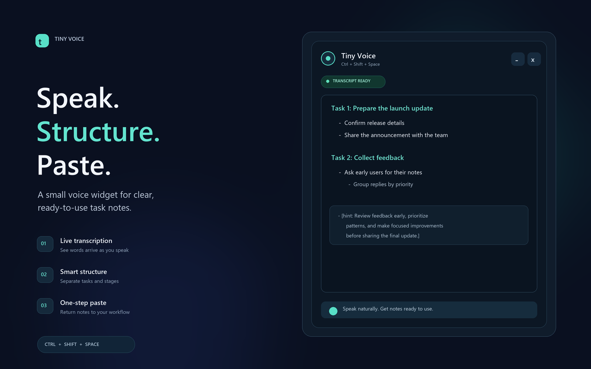

# Tiny Voice

Tiny Voice is a floating Windows voice widget that turns speech into structured task notes and pastes the result into the app you were using.



## What it does

- Start or stop with `Ctrl+Shift+Space` or the widget button.
- Stream a live transcript while recording, then format the complete transcript into task and stage bullets.
- Add a short, task-specific hint to each processed transcript.
- Choose **Quick** for concise, faithful task notes, or **Pro** for expanded steps, suggested checks and contextual tips.
- Press **Turbo** in the mini bar to upgrade the latest transcript to Pro on demand, without recording again.
- Render both modes as safe Markdown with titled sections and subsections. Copied notes use pairs of literal tabs for indentation and one bullet per point.
- Watch the live voice meter; microphone gain and noise suppression help normalize speech capture.
- Copy and paste the finished note back into the most recently active app.
- Collapse to a compact floating view on focus loss or after a transcript finishes. Click it to expand.
- Save audio and transcript history locally, with a tray icon for quick access.

OpenAI is used for transcription and transcript formatting. Both output modes use `gpt-6.1-sol`: Quick uses low reasoning effort, and Pro uses high effort. Quick preserves the spoken task and adds one hint; Pro adds clearly marked suggested approaches and three hints. It builds a task brief without answering the spoken request or performing tasks. Pro suggestions come from the model's general knowledge, without live research. To preserve context, postprocessing sends the current transcript, the saved transcript archive, and the latest ten transcripts to the OpenAI API. Local audio files remain in the recordings folder; audio is also sent to OpenAI for transcription. The API key is read from `OPENAI_API_KEY` at launch and is never placed in the WebView.

## Run on Windows

Requirements: Node.js, Rust with the MSVC toolchain, and WebView2.

```powershell
git clone https://github.com/nikhil-swamix/tiny-voice.git
cd tiny-voice
npm install
$env:OPENAI_API_KEY = Read-Host 'OpenAI API key'
npm run desktop
```

The standalone debug build is written to `src-tauri/target/debug/tiny-voice.exe`. A production build is available with `npm run desktop:release`.

The app stores recordings and transcripts in `%LOCALAPPDATA%/com.local.tinyvoice/recordings`. Audio is retained until you remove it. Live transcription and final file transcription each send audio to OpenAI; the final formatting request includes the saved transcript context described above. The native clipboard helper pastes only when Windows can restore the previously active app.

Stopping a recording processes it in the selected mode, renders it, and copies and pastes the exact finished Markdown into the app captured when recording began. Turbo does the same for its upgraded output, using the app active before the Turbo click. Quick and Pro variants are saved as separate Markdown files; upgrades reuse the original raw transcript and do not duplicate history. Recording remains available while processing runs. A failed Pro upgrade keeps the existing output.

The expanded view shows the model identifier and reasoning effort returned by the provider for that output. Missing metadata is marked unverified. The requested settings are separate from this returned metadata.

## Product images

- `screenshots/product-preview.png` is a product-oriented interface mockup.
- `screenshots/widget-crop.png` is the auto-cropped widget detail from that mockup.
- Regenerate them on Windows with `python -m pip install Pillow` and `python scripts/create_preview.py`.

## Development

```powershell
npm install
npm run dev
```

To build the desktop app, use `npm run desktop`. Recordings, API credentials, generated binaries, and Rust build output are excluded from Git.
